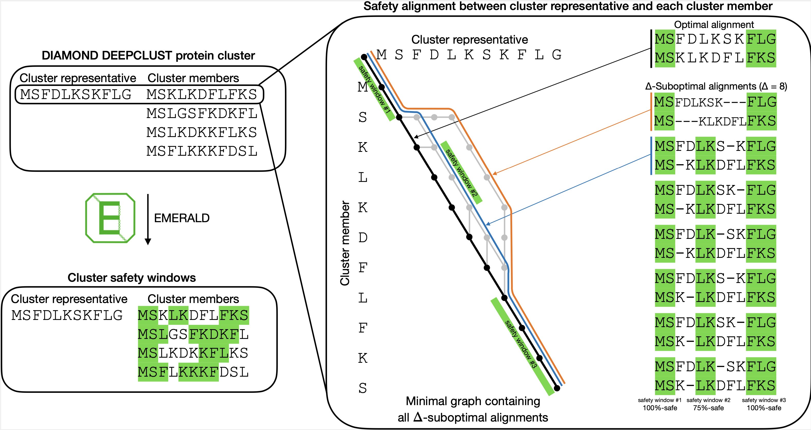

# EMERALD manual
[](https://anaconda.org/bioconda/emerald)
[](https://www.gnu.org/licenses/gpl-3.0.html)

1. [Introduction](#sec1)
2. [Installation](#sec2)\
2.1. [Installing from conda](#sec2.1)\
2.2. [Compile from source](#sec2.2)
3. [Running EMERALD](#sec3)\
3.1. [EMERALD input](#sec3.1)\
3.2. [Command line options](#sec3.2)\
3.3. [EMERALD output](#sec3.3)\
3.4. [Example](#sec3.4)\
3.5. [Precomputed alignment safety windows](#sec3.5)
4. [About EMERALD](#sec4)

<a name="sec1"></a>
# Introduction
EMERALD is a command line protein sequence aligner that explores the suboptimal space and calculates **$\alpha$-safety windows**: partial alignments that are contained in an $\alpha$ proportion of all suboptimal alignments.
EMERALD takes FASTA cluster files and aligns one selected representative sequence to all the other sequences.\
EMERALD's features include
- using custom substitution matrices (by default: BLOSUM62) and affine-linear gap score
- approximating large integers with floats for gain of computational speed but loss of accurate output
- multi threading
- selecting a custom representative sequence

<a name="overview"></a>

Schematic representation of EMERALD’s safety window calculation

<a name="sec2"></a>
# Installation
EMERALD is already compiled for Linux and Mac OS silicon.
You can download the EMERALD binary in the  and run it on the command line.

<a name="sec2.1"></a>
### Conda installation
EMERALD can be installed via conda:
```
 conda install -c conda-forge -c bioconda emerald 
 ```

<a name="sec2.2"></a>
### Compile from source
EMERALD is written in C++ and uses the [gmp library](https://gmplib.org/) for the representation of big integers.
Additionally, [cmake](https://cmake.org/install/) is needed for the compilation.
After installing gmp and downloading the source, navigate to its main directory and run
```
cmake .
```
followed by
```
make
```
to compile.

<a name="sec3"></a>
# Running EMERALD
Use ``` --help ``` for a first overview of the commands.

<a name="sec3.1"></a>
### EMERALD input
EMERALD expects `.fasta` cluster files of protein sequences.\
EMERALD defines two kinds of sequences: the singular `representative sequence` and `cluster members` for all the other sequences. The representative sequence is aligned with all the cluster members, resulting in $n-1$ alignments for a cluster of size $n$.

<a name="sec3.2"></a>
### Command line options
##### The basic options are the following
- ```-f, --file {FILE}``` Path to input FASTA file, **mandatory argument**.
-  ```-o, -output {FILE}``` Path to output file, **mandatory argument**.
- ```-a, --alpha {value}``` $\alpha$ value for safety, $0.5 < \alpha \leq 1$, by default: 0.75. The safety windows will be partial alignments contained in an $\alpha$ proportion of all alignments. If $\alpha$ is chosen outside this range, a warning will be displayed. EMERALD will keep running but it can crash.
- ```-d, --delta {value}``` $\Delta$ value for the size of the suboptimal space, any positive integer, by default: 0. If $\Delta$ is larger, more alignments will be considered suboptimal, which will decrease the number and lengths of the safety windows.
- ```-i, --threads {value}``` How many threads to use. By default 1 thread is used.
- ```-r, --reference {sequence}``` Select a specific sequence as representative sequence by some unique identitifer in the sequence description. By default the first sequence in the cluster will be the representative.
##### More advanced options
- ```-c, --costmat {file}``` This file is a lower triangular matrix C which for which C[a][b] is the aligning score of the amino acids a and b. The amino acids are given in the following order:
```Ala  Arg  Asn  Asp  Cys  Gln  Glu  Gly  His  Ile  Leu  Lys  Met  Phe  Pro  Ser  Thr  Trp  Tyr  Val```. Examples are given in the [utils](./utils) directory.
- ```-s, --special {value}``` is an integer assigned to the score of aligned amino acids in which one of the two is not included in the list above.
- ```-g, --gapcost {value}``` and ```-e, --startgap {value}``` Defines the affine-linear gap score function, by default -1 and -11, respectively.
- ```-m, --windowmerge``` In addition to printing out the calculated safety windows, EMERALD merges them and prints additional lines with the merged safety windows. Safety windows get merged if they are intersecting or adjacent to each other.
- ```-w, --drawgraph {dir}``` **Experimental**: Writes dot graph files into the given directory plotting the suboptimal alignment graph.

By default, EMERALD uses the [BLOSUM62](https://en.wikipedia.org/wiki/BLOSUM) substitution matrix for its cost assignments.

<a name="sec3.3"></a>
### EMERALD output
EMERALD's output is in stdout. The first part of the output is the following.
```
Representative sequence description
Representative sequence
Number of aligned sequence pairs
```
Following for every aligned sequence pair:
```
Cluster sequence description
Cluster sequence
Number of safety windows
```
Finally, every safety window will be printed in a separate line: $L_0\,R_0\,L_1\,R_1$, first for the representative sequence $[L_0, R_0)$ and then for the cluster sequence $[L_1, R_1)$.\
Safety windows are half open intervals, the left index is inclusive and the right index is exclusive, and indexing starts at 0.

<a name="sec3.4"></a>
### Example
`examples/ex1.fasta` (same as in the [Overview](#overview)):
```
>Representative sequence
MSFDLKSKFLG
>Cluster member 1
MSKLKDFLFKS
>Cluster member 2
MSLGSFKDKFL
>Cluster member 3
MSLKDKKFLKS
>Cluster member 4
MSFLKKKFDSL
```
Output:
```
$ ./emerald -f examples/ex1.fasta -o examples/ex1.out -a 0.75 -d 8
>Representative sequence
MSFDLKSKFLG
5
>Cluster member 1
MSKLKDFLFKS
3
0 2 0 2
4 6 3 5
8 11 8 11
>Cluster member 2
MSLGSFKDKFL
2
0 3 0 3
4 9 5 10
>Cluster member 3
MSLKDKKFLKS
2
0 2 0 2
7 10 6 9
>Cluster member 4
MSFLKKKFDSL
2
0 3 0 3
5 9 4 8
```
<a name="sec3.5"></a>
### Precomputed alignment safety windows
We already pre-computed safety windows for the DIAMOND2 DeepClust clustered SwissProt Database (~400k seqs). If users wish to use this pre-computed dataset, they can download it from [figshare](https://figshare.com/articles/dataset/data_zip/21720299/4).

<a name="sec4"></a>
# About EMERALD
EMERALD is being developed by Andreas Grigorjew in the [Graph Algorithms](https://www.helsinki.fi/en/researchgroups/algorithmic-bioinformatics/teams/graph-algorithms) team part of the [Algorithmic Bioinformatics](https://www.helsinki.fi/en/researchgroups/algorithmic-bioinformatics) group at the University of Helsinki.

If you encounter bugs or want to give feedback, please use the [Issue tracker](https://github.com/algbio/emerald/issues).

#### Paper
Please cite the following reference when using EMERALD for your research:
- Grigorjew, A., Gynter, A., Dias, F.H. *et al.* Sensitive inference of alignment-safe intervals from biodiverse protein sequence clusters using EMERALD. Genome Biol **24**, 168 (2023). https://doi.org/10.1186/s13059-023-03008-6

Experimental data was clustered using DIAMOND DeepClust:
- Buchfink B, Ashkenazy H, Reuter K, Kennedy JA, Drost HG, "Sensitive clustering of protein sequences at tree-of-life scale using DIAMOND DeepClust", *bioRxiv* 2023.01.24.525373; doi: https://doi.org/10.1101/2023.01.24.525373
