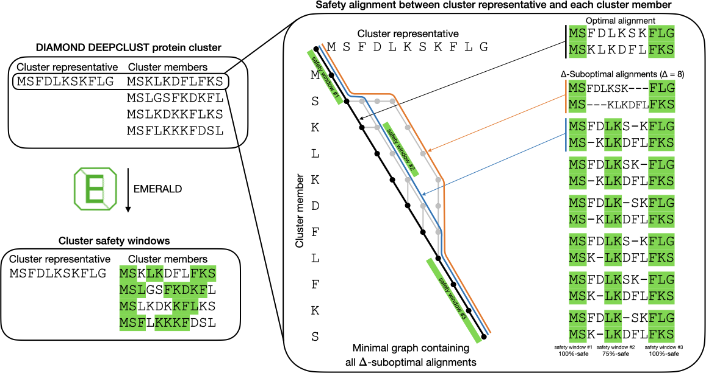

# Introduction
EMERALD is a commandline protein sequence aligner that explores the suboptimal space and calculates **$\alpha$-safety windows**: parts of a suboptimal alignment that are contained in an $\alpha$ proportion of all suboptimal alignments.\
EMERALD takes FASTA cluster files and aligns one selected representative sequence to all the other sequences.\
EMERALD's features include
- using custom substitution matrices (by default: BLOSUM62) and affine-linear gap score
- approximating large integers with floats for gain of computational speed but loss of accurate output
- multi threading
- selecting a custom representative sequence

<a name="overview"></a>

Schematic representation of EMERALD’s safety window calculation

# First steps
### Install
You can download the EMERALD binary in the Releases page and run it on the command line.

### Alternatively: Compile from source
EMERALD is written in C++ and uses the [gmp library](https://gmplib.org/) for the representation of big integers.
Additionally, [cmake](https://cmake.org/install/) is needed for the compilation.
After installing gmp and downloading the source, navigate to its main directory and run
```
cmake .
```
followed by
```
make
```
to compile.
Alternatively, it is possible to link the source files and the gmp library directly yourself.

### How to use
Use ``` --help ``` for a first overview of the commands.

#### Most important command line arguments
```-f, --file {FILE}``` Path to FASTA file, mandatory argument.\
```-a, --alpha {value}``` $\alpha$ value for safety, $0.5 < \alpha \leq 1$, by default: 0.75\
```-d, --delta {value}``` $\Delta$ value for the suboptimal space, any positive integer, by default: 0\
```-i, --threads {value}``` How many threads to use. By default 1 thread is used.\
```-r, --reference {sequence}``` Select specific sequence as representative sequence by some unique identitifer in the sequence description. By default the first sequence in the cluster will be the representative.

#### Output format
EMERALD's output is in stdout. The first part of the output is the following.
```
Representative sequence description
Representative sequence
Number of aligned sequence pairs
```
Following for every aligned sequence pair:
```
Cluster sequence description
Cluster sequence
Number of safety windows
```
Finally, every safety window will be printed in a separate line: $L_0\,R_0\,L_1\,R_1$, first for the representative sequence $[L_0, R_0)$ and then for the cluster sequence $[L_1, R_1)$.\
Safety windows are half open intervals (i.e. the left index is inclusive and the right index is exclusive) and indexing starts at 0.

#### Examples
examples/ex1.fasta (same as in the [Overview](#overview)):
```
>Representative sequence
MSFDLKSKFLG
>Cluster member 1
MSKLKDFLFKS
>Cluster member 2
MSLGSFKDKFL
>Cluster member 3
MSLKDKKFLKS
>Cluster member 4
MSFLKKKFDSL
```
Output:
```
$ ./emerald -f examples/ex1.fasta -a 0.75 -d 8 --ref "Representative sequence"
>Representative sequence
MSFDLKSKFLG
5
>Cluster member 1
MSKLKDFLFKS
3
0 2 0 2
4 6 3 5
8 11 8 11
>Cluster member 2
MSLGSFKDKFL
2
0 3 0 3
4 9 5 10
>Cluster member 3
MSLKDKKFLKS
2
0 2 0 2
7 10 6 9
>Cluster member 4
MSFLKKKFDSL
2
0 3 0 3
5 9 4 8
```
